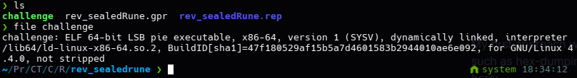
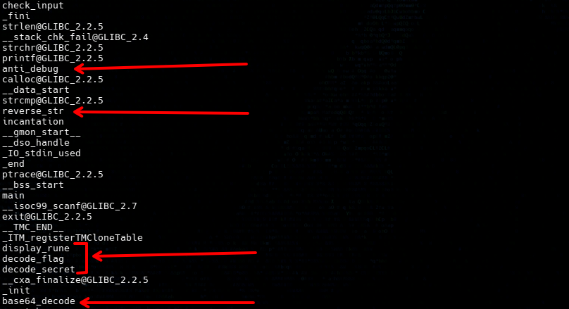
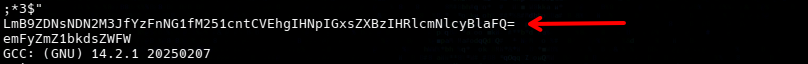
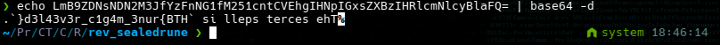
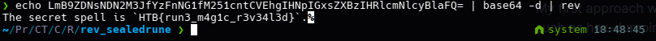

## Sealed Rune

Challenge 1 in the Reversing category of HackTheBox 'Cyber Apocalypse CTF 2025: Tales from Eldoria'.

To begin with, the challenge provides a 64-bit ELF binary, the other two files seen on screen are the files created by Ghidra, these are not needed but i find decompiling and going over the source-code after the challenge was a great way to see the whats happening during the running of the binary line for line.

 

My first approach was to simply see any data stored inside, this can be done multiple ways, such as hex-dumping and/or checking for strings, I opted for the later as I can just run the ```strings``` command, its raw output contained a few key pieces of information, firstly I noticed some interesting function names:

 

Before moving on, two of these stood out immediately, `base64_decode` and `reverse_str`.

This implies there may be a reversed string, and/or base64 encoded string within this binary, with further observation we can see:

 

This string of characters looks very similar to what may be presented once you use base64 encoding on some data, so the next step would be to validate this theory,

 

Ah, interesting, this certainly looks like a reversed string, as the `reverse_str` function implies, so if we reverse it...

 

There we have it, the flag! 

This was one of two challenges I managed to complete within the time-frame of Cyber Apocalypse 2025 as part of the team Sinister Script, it was great fun working through the challenges with my team-mates and hope to contribute even more next year!
