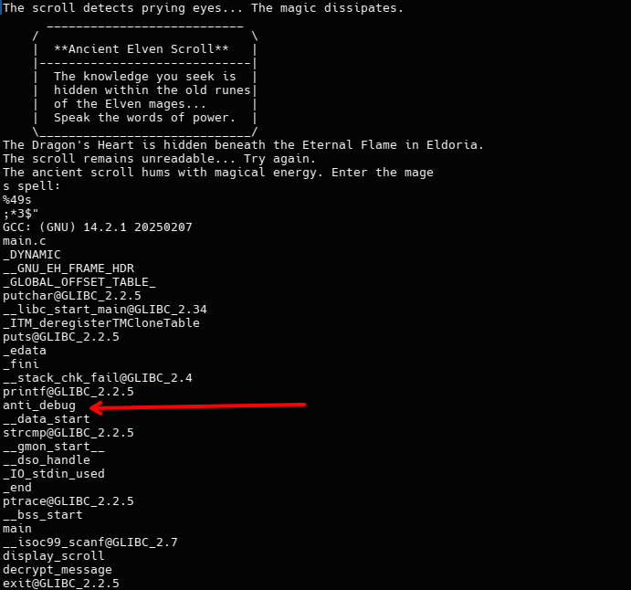

## Encrypted Scroll

The second challenge in the Reversing catagory was Encrypted scroll, this like the previous challange is a 64-bit ELF binary


The first thing I attempted was to run ```strings``` again to see if there was any lowhanging fruit stored within.



After dumping the strings, I found nothing of worth, you can see the scrolling text that appears when you run the binary and then awaits the input, however there is one section that may prevent us from opening this within a debugger, this being the ```anti_debug``` string, this implies there may be a function that will prevent us from debugging this, and with further testing, such as attaching GDB to this, we can see:


This confirms it wont be as simple as the last challenge, this ```anti_debug``` function will need to be bypassed, for this I'll need to decompile the binary and have a closer look at whats going on, for this i'll be using ghidra and its auto analysis.


Here looking at the analysed C code, its clear the ```anti_debug``` function is running first before the scroll is displayed or any input is handled, so my approach will be to avoid it or bypass it, this will need to first involve seeing what the simplest approach will be.


The anti debugger function seems to use ptrace, store the output into ```lvar1``` and then run an if statement seeing if is equal to -1, if I just prevent this call with a quick patch in the assembly by changing the call to ptrace to just repeating its last instruction, in theory it should just never equal -1 and skip the check.


### Before
 

### After


I can then export this binary and test if it will run with the debugger!


Perfect. Now, from the decompilation, we can look at the next few lines of instructions and look for where the binary is comparing what we enter, ```decrypt_message``` seems to take in the same variable that the ```scanf``` function is storing, scanf being a way to take user input from the console, looking inside this decrypt function, we can see a large for loop completing various operations each loop, but just after we can see the ```strcmp``` which compares two variables. This must be where its taking our input and comparing it to the flag.


There are a few approaches to take here, patch the binary again to just ignore this check, or just attempt to view whats happening in memory during the running process through a debugger, I chose the latter, this can be done with running the binary through GDB and setting a breakpoint at the strcmp function with ```break strcmp```.

There we have it, the flag is being pointed too in two seperate registers, rdx and rsi.


This was great fun to on with and a great exercise for strengthening my fundementals and was extremely proud when I managed to solve it, unfortunately i didn't have enough time to work through the next reversing challenges but will be going over them over the next few weeks in preperation for next year!

Author: Cede555

